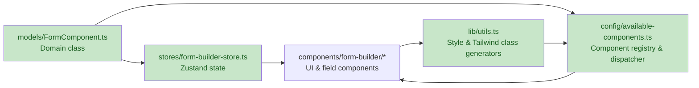
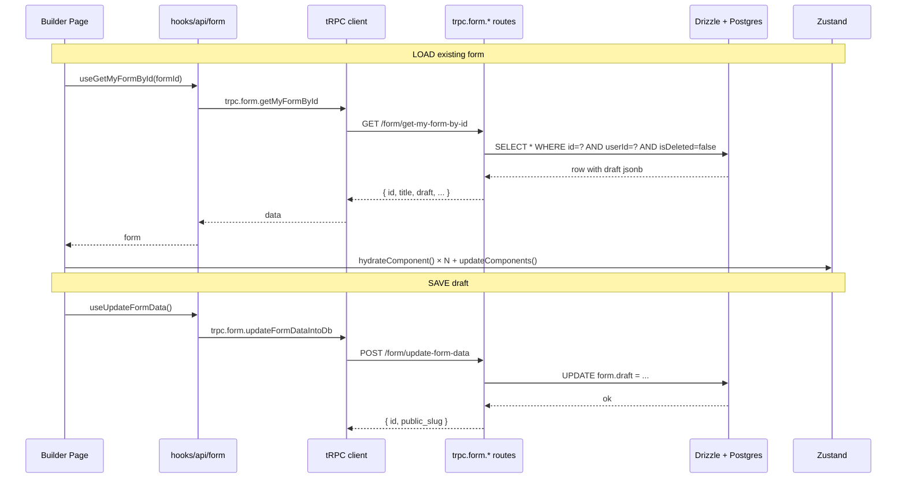

# Form Builder Module — Migration Wiki

> **Purpose:** Wiki reference for the Form Builder migration from `trpc-monorepo/apps/web-old` into this monorepo (`form-builder/`).
> **Audience:** AI agent / future engineer continuing the migration.
> **Last updated:** Phase 1.1 complete.

---

## 📊 Migration Status

| Phase | Description | Status |
|---|---|---|
| **0** | Prep: install deps, add missing shadcn (`pre`, `native-select`), append style helpers to `lib/utils.ts` | ⏳ Pending |
| **1** | Backend (tRPC + service) extensions | 🟡 In progress |
| 1.1 | Add `getAllMyForms` + `getMyFormById` endpoints | ✅ **Done** |
| 1.2 | Add frontend React hooks for the 2 new endpoints | ✅ **Done** |
| **2** | Types & model layer (`apps/web/types/`, `models/`, `stores/`, `lib/templates/`) | ⏳ Pending |
| **3** | Registry + field components + canvas + sidebar + dialogs + helpers | ⏳ Pending |
| **4** | Hooks (history, useLoadTemplates, as-ref, lazy-ref) | ⏳ Pending |
| **5** | Route (`app/(protected)/form/builder/[id]/page.tsx`) | ⏳ Pending |
| **6** | Static assets (`public/templates/*.json`) | ⏳ Pending |
| **7** | Verify (lint, type-check, smoke test) | ⏳ Pending |

---

## 🎯 TL;DR

- The Form Builder is a **drag-and-drop visual form designer** (17+ field types, 12-col responsive grid, WYSIWYG, undo/redo, code export).
- It's a **large, internally cohesive module** — the 4 "spine" files depend on each other, but the rest is independent.
- Migration target: place all Form Builder code under `apps/web/components/form-builder/` + a few root-level folders (`stores/`, `models/`, `config/`, `types/`).
- **Two new tRPC endpoints** are required for the builder (ownership-checked, returns `draft` not `published`).
- **Out of scope:** `form-credit-card.tsx` (dropped), `socialLinks.tsx` (deferred), public form responses (deferred).

## 🏁 End-to-End Goal (user's stated objective)

The full form builder workflow that must work end-to-end:

```
User (authed)          Server                Friend (unauthed)
─────────────         ──────                ──────────────────
  │                     │                          │
  ├─ Create form ──────►│                          │
  ├─ Edit in builder ──►│  (saves to `draft`)      │
  ├─ Publish ──────────►│  (saves to `published`)  │
  ├─ Get slug ─────────►│  → returns slug          │
  ├─ Share slug URL ────┼─────────────────────────►│
  │                     │◄───── Open slug page ────┤
  │                     │◄───── Fill & submit ─────┤
  │                     │  (saves response)        │
  ├─ View responses ───►│                          │
```

**Implication:** beyond the builder UI, we also need a **public form viewer** (e.g. `app/(public)/form/[slug]/page.tsx`) that uses the existing `showTheFormBySlug` endpoint to render the published form, and `storeFormSubmissionIntoDb` to save responses. This is added to scope as a Phase 15 follow-up.

---

## 📍 Source & Target

| | Old (source) | New (target) |
|---|---|---|
| Project root | `c:\Users\jmtyg\OneDrive\Desktop\Hackathon Monorepo\trpc-monorepo\apps\web-old\` | `c:\Users\jmtyg\OneDrive\Desktop\Hackathon Monorepo\form-builder\apps\web\` |
| Builder route | `app/dashboard/form/builder/[id]/page.tsx` | `app/(protected)/form/builder/[id]/page.tsx` |
| Auth hook | `useUser` (stub) | `useMe` (real) |
| tRPC client | `trpc/client.ts` (legacy) | `trpc/client.ts` (existing) |
| UI primitives | `components/ui/*.tsx` (~40 files) | `components/ui/*.tsx` (~30 files — **2 missing**: `pre`, `native-select`) |
| Database | Drizzle + same `form` table | Same Drizzle + same `form` table ✅ |

---

## 🏗️ Architecture — The 4 Spine Files

These 4 files are the heart. Everything else hangs off them. **Migration order: keep them together.**



| File (in new project) | Source (old) | Coupling | Notes |
|---|---|---|---|
| `apps/web/models/form-component.ts` | `models/FormComponent.ts` | Self-contained | Pure class — copy as-is |
| `apps/web/stores/form-builder-store.ts` | `stores/form-builder-store.ts` | Model + types only | Self-contained state |
| `apps/web/config/available-components.ts` | `config/available-components.ts` | Imports all field components | Update import paths |
| `apps/web/lib/utils.ts` (APPEND) | `lib/utils.ts` | Types only | Append style helpers; keep `cn`/`twMerge` already there |

---

## 🗂️ Target Folder Structure (new project)

```
form-builder/
├── apps/web/
│   ├── app/(protected)/form/builder/
│   │   ├── [id]/page.tsx              ← adapted orchestrator
│   │   └── layout.tsx                 ← copied as-is
│   │
│   ├── components/
│   │   ├── ui/                        ← existing + ADD: pre.tsx, native-select.tsx
│   │   └── form-builder/              ← NEW module folder
│   │       ├── canvas/                (generate-canvas-grid, sortable-row)
│   │       ├── dialogs/               (9 files)
│   │       ├── form-components/       (12 fields + wysiwyg/)
│   │       ├── helpers/               (7 files)
│   │       ├── sidebar/               (groups/ sub-folder)
│   │       ├── ui/                    (header/, undo-redo, etc.)
│   │       └── mainCanvas.tsx
│   │
│   ├── config/                        ← NEW
│   │   └── available-components.ts
│   │
│   ├── models/                        ← NEW
│   │   └── form-component.ts
│   │
│   ├── stores/                        ← NEW
│   │   └── form-builder-store.ts
│   │
│   ├── types/                         ← NEW (form-builder only)
│   │   ├── form-component.types.ts
│   │   ├── form-builder.types.ts
│   │   └── template.types.ts
│   │
│   ├── hooks/
│   │   ├── api/form/index.ts          ← REWRITE to new tRPC names
│   │   ├── use-history.ts
│   │   ├── useLoadTemplates.ts
│   │   ├── use-as-ref.ts
│   │   └── use-lazy-ref.ts
│   │
│   ├── lib/
│   │   ├── utils.ts                   ← APPEND style helpers
│   │   └── templates/constants.ts
│   │
│   └── public/templates/*.json        (15 files copied)
│
├── packages/trpc/server/routes/form/  ← EXTEND
├── packages/services/form/            ← EXTEND
└── docs/form-builder-migration.md     ← (this file)
```

**DRY principle:** All builder code lives under `apps/web/`. No new workspace package — would over-engineer it.

---

## 🧠 Data Model — `FormComponentModel`

```
FormComponentModel
├── id, type, category: "form" | "content"
├── label, label_info, label_description
├── properties.style       ← all responsive settings
│   ├── asCard, cardLayout, showLabel, visible
│   ├── labelPosition, labelAlign, textAlign
│   ├── colSpan (1-12), colStart (auto-12)
│   ├── icon, iconPosition, iconStrokeWidth
│   └── flexAlign
├── properties.variant     ← "default" | "outline" | ...
├── attributes             ← raw HTML attrs (id, name, class, placeholder...)
├── options[]              ← {label, value, labelDescription, checked}
├── validations            ← {required, min, max, minLength, maxLength,
│                              contains, notContains, greater, lower,
│                              equals, notEquals, greaterEqual, lowerEqual,
│                              email, url}
├── overrides: { sm, md, lg }   ← per-viewport delta
└── content                ← HTML for "content" category (WYSIWYG)
```

**Key subtlety:** The `overrides` map + `getField(field, viewport)` resolver uses a **fallback chain** `lg → md → base` so unspecified viewports inherit.

### Field types (17)

`text, input, textarea, number, email, password, file, tel, url, select, native-select, checkbox, checkbox-group, radio, date, switch, button, submit-button, reset-button`

❌ **Excluded:** `credit-card` (dropped from scope — has dead `react-payment-inputs` imports)

---

## 🗃️ State Management — Zustand store

**Single store** with `persist` middleware:

| Slice | Purpose |
|---|---|
| `mode` | `'editor' \| 'editor-preview' \| 'preview' \| 'export'` |
| `viewport` | `'sm' \| 'md' \| 'lg'` — drives responsive overrides |
| `components` | `FormComponentModel[]` — the form tree |
| `selectedComponent` | Currently focused in inspector |
| `formTitle`, `formId`, `loadedTemplateId` | Identity |
| `editor` | TipTap Editor ref |
| `history` | Snapshots for undo/redo (50 deep) |
| Actions | `addComponent`, `removeComponent`, `updateComponent`, `updateComponents`, `moveComponent`, `duplicateComponent`, `loadTemplate`, `clearForm`, `saveSnapshot`, `undo`, `redo`, `jumpToSnapshot` |

**Persistence:** Only `currentTheme` is persisted. Everything else is recomputed/hydrated from DB on route entry.

---

## 🖱️ Drag-and-Drop — dnd-kit

- Library: `@dnd-kit/core` + `@dnd-kit/sortable` + `@dnd-kit/utilities`
- **Two drag sources:**
  1. **Sidebar** → action `"add"` → calls `addComponent()` + `moveComponent()`
  2. **Canvas row** → action `"move"` → calls `moveComponent(oldIndex, newIndex)`
- **Drop zones:** 4 invisible per-row targets (`left`, `right`, `top`, `bottom`)
- **Grid balancing:** `getGridRows(components, viewport)` + `updateColSpans()` auto-balance columns when a row is partial

---

## ✅ Validation — Zod

- **Schema generation** (runtime): `getZodSchemaForComponents(components, asString)` builds `z.object({...})`
- **Per-field type rules:** different validations apply to different types (e.g. `number` vs `text`)
- **Runtime use:** `react-hook-form` + `zodResolver` in `generate-canvas-grid.tsx`

---

## 🌐 API Surface — tRPC endpoints

### New endpoints added (Phase 1.1) ✅

| Endpoint | Procedure | Service method | Status |
|---|---|---|---|
| `form.getAllMyForms` | `protectedProcedure` | `FormService.getAllMyForms` | ✅ Done |
| `form.getMyFormById` | `protectedProcedure` | `FormService.getMyFormById` | ✅ Done |

**Key design points:**
- Both are `protectedProcedure` — require authenticated user
- `getMyFormById` ownership-checked: `eq(id) AND eq(userId) AND eq(isDeleted, false)`
- `hasDraft` / `hasPublished` are SQL-derived booleans (`sql<boolean>...</IS NOT NULL</sql>`)
- Soft-deleted forms excluded
- Newest-first ordering

**Files modified (Phase 1.1):**
- [packages/services/form/model.ts](file:///c:/Users/jmtyg/OneDrive/Desktop/Hackathon%20Monorepo/form-builder/packages/services/form/model.ts) — added input schemas
- [packages/trpc/server/routes/form/model.ts](file:///c:/Users/jmtyg/OneDrive/Desktop/Hackathon%20Monorepo/form-builder/packages/trpc/server/routes/form/model.ts) — added input/output models
- [packages/services/form/index.ts](file:///c:/Users/jmtyg/OneDrive/Desktop/Hackathon%20Monorepo/form-builder/packages/services/form/index.ts) — added 2 service methods
- [packages/trpc/server/routes/form/route.ts](file:///c:/Users/jmtyg/OneDrive/Desktop/Hackathon%20Monorepo/form-builder/packages/trpc/server/routes/form/route.ts) — added 2 procedures

### Existing endpoints (not touched)

| Endpoint | Use in builder | Action |
|---|---|---|
| `form.storeFormTitleAndDesriptionIntoDb` | Create new form | ✅ RENAME in hooks |
| `form.updateFormDataIntoDb` | Save draft / publish | ✅ RENAME in hooks |
| `form.showTheFormBySlug` | Public read (NOT used by builder) | ⏭️ Don't use |
| `form.storeFormSubmissionIntoDb` | Submit response (NOT used by builder) | ⏭️ Don't use |
| `form.showAllThePublicForms` | Public list (NOT used by builder) | ⏭️ Don't use |

---

## 🔄 Data Flow



---

## 🔗 Coupling Analysis

| Layer | Coupling | Reusability |
|---|---|---|
| `FormComponentModel` class | Self-contained | **High** — copy as-is |
| Zustand store | Model + types only | **High** — copy as-is |
| Style utilities | Types only | **High** — copy as-is |
| Field components (12) | Registry only | **High** — copy as-is |
| Wysiwyg editor | TipTap only | **High** — copy as-is |
| Helpers (zod, render, etc.) | Pure | **High** — copy as-is |
| Sidebar groups | Self-contained | **High** — copy as-is |
| Hooks (`use-history`, `useLoadTemplates`) | Self-contained | **High** — copy as-is |
| `hooks/api/form/*` | Tightly bound to tRPC names | **Low** — REWRITE to new endpoints |
| Builder page orchestrator | Auth + tRPC + UI | **Medium** — adapt to new route group |
| `mainCanvas.tsx` ↔ `canvas/*` ↔ `helpers/render*` ↔ registry | Interdependent | **Must move together** |

---

## 📋 Key Decisions (decision log)

| # | Decision | Why |
|---|---|---|
| 1 | Add `getMyFormById` (new) instead of reusing `showTheFormBySlug` | `showTheFormBySlug` returns `published` (not `draft`); it's `publicProcedure` (not ownership-checked) |
| 2 | Both new endpoints are `protectedProcedure` | Builder edits drafts; only owner can edit |
| 3 | Drop `form-credit-card.tsx` from scope | Dead `react-payment-inputs` imports, no real implementation |
| 4 | Use `useMe` (not `useUser`) | New project's auth hook is `useMe` |
| 5 | Route target: `app/(protected)/form/builder/[id]/page.tsx` | Inherits existing `AuthGuard` from `(protected)/layout.tsx` |
| 6 | Append style helpers to existing `lib/utils.ts` | DRY — keeps `cn`/`twMerge` in one place |
| 7 | Place module under `apps/web/` (not new workspace package) | Avoid over-engineering |
| 8 | Reuse existing `AuthGuard` in `(protected)/layout.tsx` | DRY — don't add a second guard |
| 9 | Rename old endpoint hooks in new project | Old: `useGetFormDisplayList` → New: `useGetAllMyForms`; etc. |

---

## ⚠️ Risks & Open Questions

### High priority
- [ ] **Pre-existing uncommitted changes** in working dir:
  - `apps/web/app/(protected)/dashboard/page.tsx` (modified)
  - `apps/web/components/layout/app-sidebar.tsx` (**DELETED** — may break dashboard)
  - `apps/web/app/(protected)/form/` (new untracked dir)
- [ ] **Missing shadcn `pre.tsx`** — required by `MainCanvas` & dialogs
- [ ] **Missing shadcn `native-select.tsx`** — required by `FormNativeSelect`
- [ ] **Tailwind classes** like `@3xl:`, `@5xl:` (custom container queries) — verify Tailwind v4 supports
- [ ] **TipTap v3 vs v2** — old project uses 3.23.6; new project has nothing yet
- [ ] **`@dnd-kit` + React 19** — verify version compatibility

### Medium priority
- [ ] **`prism-react-renderer` + React 19** — verify version
- [ ] **`prettier/standalone`** bundle size — lazy-load on dialog open
- [ ] **`react-payment-inputs`** — confirm `form-credit-card.tsx` removal is safe
- [ ] **Old `socialLinks.tsx`** has all icons commented out — copy as-is (effectively no-op)

### Deferred (out of scope for migration)
- `verifyFormPassword` endpoint
- `getFormResponses` endpoint
- Code gallery (100 `public/templates/code/*.tsx` files)
- Live form response viewer

---

## 📦 Dependencies to Install (Phase 0)

```json
{
  "apps/web/package.json": {
    "dependencies": {
      "@dnd-kit/core": "^6.x",
      "@dnd-kit/sortable": "^9.x",
      "@dnd-kit/utilities": "^3.x",
      "@tanstack/react-virtual": "^3.x",
      "@tiptap/core": "^3.x",
      "@tiptap/react": "^3.x",
      "@tiptap/starter-kit": "^3.x",
      "@tiptap/extension-heading": "^3.x",
      "@tiptap/extension-text-align": "^3.x",
      "@tiptap/extension-text-style": "^3.x",
      "@tiptap/extension-underline": "^3.x",
      "zustand": "^4.x",
      "prism-react-renderer": "^2.x",
      "prettier": "^3.x",
      "framer-motion": "^11.x"
    }
  }
}
```

---

## 🔗 Source Code References (old project)

For comparison & review during migration:

- Orchestrator: [page.tsx](file:///c:/Users/jmtyg/OneDrive/Desktop/Hackathon%20Monorepo/trpc-monorepo/apps/web-old/app/dashboard/form/builder/[id]/page.tsx)
- Store: [form-builder-store.ts](file:///c:/Users/jmtyg/OneDrive/Desktop/Hackathon%20Monorepo/trpc-monorepo/apps/web-old/stores/form-builder-store.ts)
- Model: [FormComponent.ts](file:///c:/Users/jmtyg/OneDrive/Desktop/Hackathon%20Monorepo/trpc-monorepo/apps/web-old/models/FormComponent.ts)
- Registry: [available-components.ts](file:///c:/Users/jmtyg/OneDrive/Desktop/Hackathon%20Monorepo/trpc-monorepo/apps/web-old/config/available-components.ts)
- Canvas: [generate-canvas-grid.tsx](file:///c:/Users/jmtyg/OneDrive/Desktop/Hackathon%20Monorepo/trpc-monorepo/apps/web-old/components/form-builder/canvas/generate-canvas-grid.tsx)
- Dialogs: [dialogs/](file:///c:/Users/jmtyg/OneDrive/Desktop/Hackathon%20Monorepo/trpc-monorepo/apps/web-old/components/form-builder/dialogs/)
- Field components: [form-components/](file:///c:/Users/jmtyg/OneDrive/Desktop/Hackathon%20Monorepo/trpc-monorepo/apps/web-old/components/form-builder/form-components/)
- Helpers: [helpers/](file:///c:/Users/jmtyg/OneDrive/Desktop/Hackathon%20Monorepo/trpc-monorepo/apps/web-old/components/form-builder/helpers/)
- Sidebar: [sidebar/](file:///c:/Users/jmtyg/OneDrive/Desktop/Hackathon%20Monorepo/trpc-monorepo/apps/web-old/components/form-builder/sidebar/)
- Old tRPC hooks: [hooks/api/form/index.ts](file:///c:/Users/jmtyg/OneDrive/Desktop/Hackathon%20Monorepo/trpc-monorepo/apps/web-old/hooks/api/form/index.ts)

---

## 🔗 Target Code References (new project)

- New route (stub): [app/(protected)/form/builder/[id]/page.tsx](file:///c:/Users/jmtyg/OneDrive/Desktop/Hackathon%20Monorepo/form-builder/apps/web/app/(protected)/form/builder/[id]/page.tsx)
- tRPC form route: [packages/trpc/server/routes/form/route.ts](file:///c:/Users/jmtyg/OneDrive/Desktop/Hackathon%20Monorepo/form-builder/packages/trpc/server/routes/form/route.ts)
- tRPC form models: [packages/trpc/server/routes/form/model.ts](file:///c:/Users/jmtyg/OneDrive/Desktop/Hackathon%20Monorepo/form-builder/packages/trpc/server/routes/form/model.ts)
- Form service: [packages/services/form/index.ts](file:///c:/Users/jmtyg/OneDrive/Desktop/Hackathon%20Monorepo/form-builder/packages/services/form/index.ts)
- Form service models: [packages/services/form/model.ts](file:///c:/Users/jmtyg/OneDrive/Desktop/Hackathon%20Monorepo/form-builder/packages/services/form/model.ts)
- Drizzle schema: [packages/database/models/form.ts](file:///c:/Users/jmtyg/OneDrive/Desktop/Hackathon%20Monorepo/form-builder/packages/database/models/form.ts)
- Auth hook: [apps/web/hooks/api/auth/index.ts](file:///c:/Users/jmtyg/OneDrive/Desktop/Hackathon%20Monorepo/form-builder/apps/web/hooks/api/auth/index.ts) (use `useMe`)
- Protected layout: [app/(protected)/layout.tsx](file:///c:/Users/jmtyg/OneDrive/Desktop/Hackathon%20Monorepo/form-builder/apps/web/app/(protected)/layout.tsx)

---

## 🧪 Verification Commands

```bash
# Type check (must pass with exit code 0)
pnpm --filter @repo/trpc exec tsc --noEmit
pnpm --filter web exec tsc --noEmit
pnpm --filter @repo/services exec tsc --noEmit

# Lint
pnpm lint

# Dev server smoke test
pnpm dev
# Navigate to /form/builder/<test-uuid> in browser

# Check pre-existing uncommitted changes before any edit
git status --short
git diff HEAD -- <file>
```

---

## 🛑 Hard Rules (do not violate)

1. **Always run `git status` and `git diff HEAD -- <file>` before editing any file** — user's working dir may have uncommitted changes that look like the "original" but aren't.
2. **Never trust the diff display alone** — verify with `git diff HEAD` and `tsc --noEmit`.
3. **Never assume a `SearchReplace` `old_str` is unique** — verify by reading the file immediately after.
4. **Always run `tsc --noEmit` after a file change** — confirms the change compiles.
5. **Use `useMe` only** — never `useUser`, `useAuthState`, or auth stubs from the old project.
6. **Both new endpoints are `protectedProcedure`** — never expose draft data publicly.
7. **Migration order matters:** `models/` → `types/` → `stores/` → `helpers/` → `form-components/` → `registry` → `canvas/` → `sidebar/` → `dialogs/` → `hooks/` → `page.tsx`.
8. **Registry must be the last file updated** in any phase — it imports from all field components.

---

## 📝 Change Log

| Date | Phase | Change |
|---|---|---|
| Initial | 0 | Created this wiki |
| Phase 1.1 | 1.1 | Added `getAllMyForms` + `getMyFormById` tRPC endpoints (model, service, route). Type check passes ✅ |
| Phase 1.2 | 1.2 | Added `useGetAllMyForms` + `useGetMyFormById` React hooks in `apps/web/hooks/api/form/index.ts`. Type check passes ✅ |
